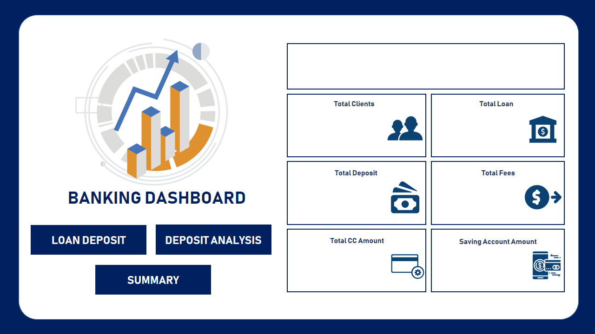
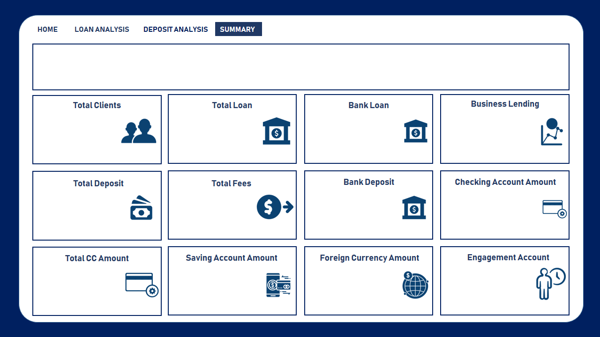

# Banking Risk Analysis Dashboard

A comprehensive **Power BI analytics solution** for monitoring a bank's client portfolio — covering risk profiling, loan and deposit analysis, client segmentation, and investment advisor performance across 3,000 banking clients.

> **Note:** The `.pbix` dashboard file, all CSV datasets, Excel workbook, and Office documents are excluded from this repository via `.gitignore`. Dashboard screenshots are shared publicly under `Banking/Design/New Design/`.

---

## Dashboard Preview

| Page | Screenshot |
|------|-----------|
| Home |  |
| Summary |  |
| Loan Analysis |  |
| Deposit Analysis |  |
| Drill Through |  |

---

## Project Objective

To build an enterprise-grade banking risk dashboard that answers:

- Which client segments carry the highest risk concentration?
- How is the loan portfolio distributed across relationship types (Retail, Institutional, Private Bank, Commercial)?
- What is the total deposit and loan exposure by loyalty tier (Jade, Gold, Silver, Platinum)?
- How do client demographics (age, nationality, gender) correlate with financial risk weights?
- Which investment advisors manage the largest or highest-risk client portfolios?
- What are the total fees, credit card balances, and savings across the client base?

---

## Dashboard Pages

### 1. Home Page
Navigation hub with six KPI summary cards:

| KPI Card | Metric |
|----------|--------|
| Total Clients | Count of all active banking clients |
| Total Loan Amount | Aggregate bank loan exposure |
| Total Deposits | Sum of all client deposits |
| Total Fees | Revenue from client fee structures |
| Total CC Amount | Total credit card balances outstanding |
| Saving Account Amount | Aggregate savings account balances |

### 2. Summary Page
High-level portfolio overview with filters for relationship type, loyalty tier, fee structure, and risk weighting.

### 3. Loan Analysis
Detailed loan portfolio breakdown by:
- Banking relationship type (Retail / Institutional / Private Bank / Commercial)
- Risk weighting (1 = Low Risk → 4 = High Risk)
- Client demographics and loyalty classification

### 4. Deposit Analysis
Deposit and savings analysis segmented by:
- Loyalty tier (Jade / Gold / Silver / Platinum)
- Foreign currency accounts vs. local deposits
- Superannuation savings and checking account balances

### 5. Drill Through
Interactive client-level drill-through pages enabling deep-dive into individual client profiles including:
- Full financial position (loans, deposits, credit cards, business lending)
- Assigned investment advisor
- Risk weighting and fee structure
- Banking relationship type

---

## Data Model

### Fact Table — `banking-clients.csv` (3,000 records)

| Category | Fields |
|----------|--------|
| Identification | Client ID, Name, Nationality |
| Demographics | Age, Gender, Location |
| Banking Metadata | Joined Bank Date, Banking Contact, Banking Relationship, Investment Advisor |
| Account Classification | Fee Structure, Loyalty Tier, Risk Weighting (1–4) |
| Financial Profile | Estimated Income, Superannuation Savings, Properties Owned |
| Credit Facilities | Credit Card Count, Credit Card Balance, Bank Loans |
| Deposits & Savings | Bank Deposits, Checking Accounts, Savings Accounts, Foreign Currency Account |
| Business Products | Business Lending |

### Dimension Tables

| Table | Records | Key Fields |
|-------|---------|-----------|
| `banking-realtionships.csv` | 4 | BRId, Relationship Type (Retail / Institutional / Private Bank / Commercial) |
| `gender.csv` | 2 | GenderId, Gender (Male / Female) |
| `investment-advisiors.csv` | 22 | IAId, Advisor Name |

### Key Classification Schemes

| Scheme | Values |
|--------|--------|
| Risk Weighting | 1 (Low) → 4 (High) |
| Loyalty Tier | Jade, Gold, Silver, Platinum |
| Fee Structure | High, Mid, Low |
| Relationship Type | Retail, Institutional, Private Bank, Commercial |

---

## Exploratory Data Analysis (EDA)

Two Jupyter notebooks document the Python-based pre-analysis:

| Notebook | Description |
|----------|-------------|
| `BankEDA (Version 1).ipynb` | Initial data exploration — schema validation, null checks, distribution plots |
| `BankEDA (Version 2).ipynb` | Enhanced analysis — risk segmentation, demographic breakdowns, correlation analysis |

**Libraries used:** `pandas`, `matplotlib`, `seaborn`, `numpy`

---

## Design Iterations

The dashboard went through three design rounds before the production version:

| Design Round | Folder | Status |
|---|---|---|
| Demo Design | `Banking/Design/Demo Design/` | Concept mockups (5 pages) |
| Old Design | `Banking/Design/Old Design/` | Previous iteration (6 pages) |
| New Design | `Banking/Design/New Design/` | **Current production version** (6 pages) |

---

## Technology Stack

| Tool | Role |
|------|------|
| Power BI Desktop | Dashboard development and visualization |
| DAX | KPI measures, calculated columns, risk aggregations |
| Power Query (M) | Data transformation, relationship joins, type casting |
| Python (pandas, seaborn) | Exploratory data analysis (EDA) |
| Jupyter Notebooks | EDA documentation and analysis workflow |
| Excel / CSV | Source data storage |
| PowerPoint / Word | Design mockups and analysis report |

---

## File Structure

```
Banking Risk Analysis/
│
├── BankEDA (Version 1).ipynb          ← Initial EDA notebook
├── BankEDA (Version 2).ipynb          ← Enhanced EDA notebook
├── Banking.csv                        ← Root-level data snapshot (excluded via .gitignore)
├── README.md                          ← Project documentation
├── .gitignore                         ← Excludes .pbix, .csv, .xlsx, .docx, .pptx
│
└── Banking/
    ├── Banking.csv                    ← Client dataset (excluded)
    ├── Banking.xlsx                   ← Excel version of dataset (excluded)
    ├── clients.csv                    ← Reference lookup (excluded)
    ├── Banking Report.docx            ← Written analysis report (excluded)
    ├── Banking.pptx                   ← Presentation deck (excluded)
    ├── Banking Dashboard_old.pbix     ← Previous dashboard version (excluded)
    │
    ├── Dashboard/
    │   └── Banking_Dashboard_2025.pbix  ← Production dashboard (excluded)
    │
    ├── datasets/
    │   ├── banking-clients.csv        ← Main fact table — 3,000 records (excluded)
    │   ├── banking-realtionships.csv  ← Relationship type dimension (excluded)
    │   ├── gender.csv                 ← Gender dimension (excluded)
    │   └── investment-advisiors.csv   ← 22 investment advisors (excluded)
    │
    ├── Design/
    │                 ← Current production screenshots (shared)
    ├── Home.png
    ├── Summary.png
    ├── Loan Analysis.png
    ├── Deposit Analysis.png
    ├── Drill Through.png
    └── Drill Through1.png


## Key Analytical Insights

- **Risk Concentration:** Clients with Risk Weight 3–4 hold a disproportionately high share of total loan exposure, signaling concentrated credit risk in higher-risk segments.
- **Loyalty & Fee Correlation:** Platinum and Jade loyalty tier clients predominantly fall under the "High" fee structure, contributing the majority of fee revenue.
- **Relationship Distribution:** Retail banking represents the largest client volume, while Private Bank and Institutional segments carry higher average loan and deposit balances.
- **Advisor Load Balancing:** 22 investment advisors are distributed across 3,000 clients, with some advisors managing significantly larger portfolios by value.
- **Demographic Spread:** The client base spans multiple nationalities with diverse income ranges, enabling targeted segmentation for product cross-selling.
- **Credit Card Exposure:** A subset of clients carries high credit card balances relative to income, a key indicator for credit risk monitoring.

---

## Privacy Note

All data used in this project is **anonymized sample data** intended for portfolio and learning purposes. No real client names, account numbers, or sensitive personal information are committed to this repository. All data files (`.csv`, `.xlsx`) and the Power BI workbook (`.pbix`) are excluded from version control.
