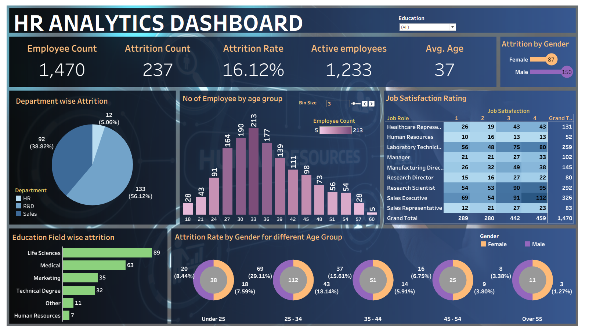
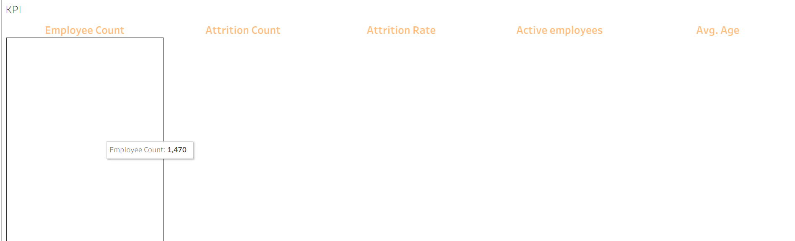
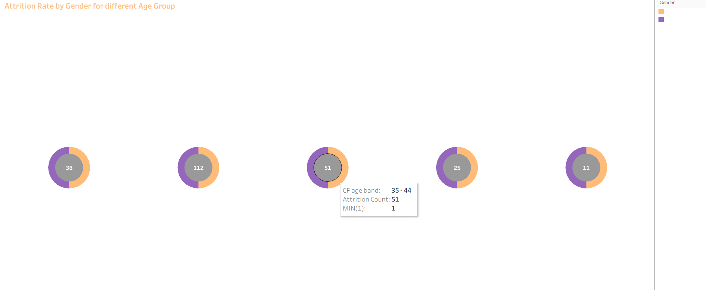
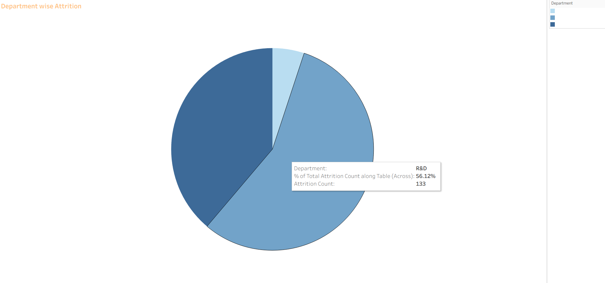
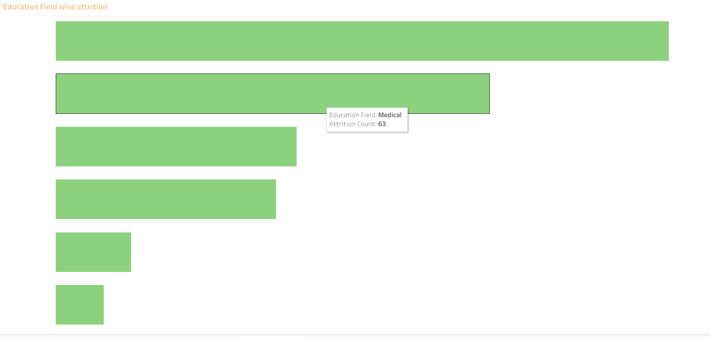
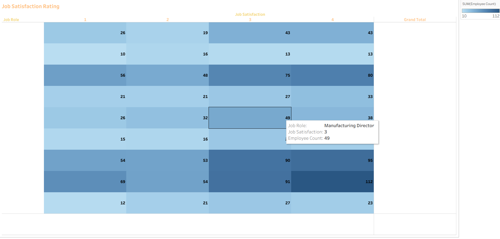
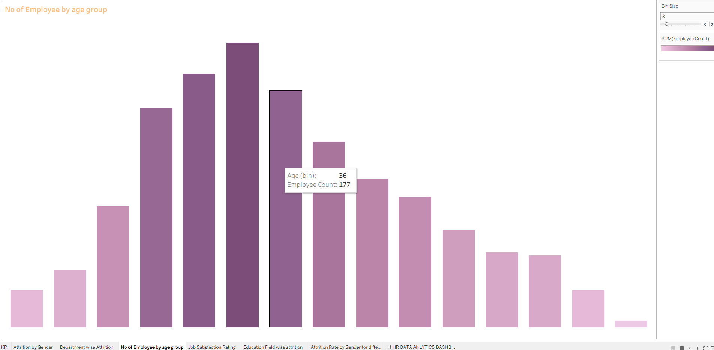

# HR Data Analytics Dashboard

A **Tableau dashboard** that analyses 1,470 employee records across attrition, job satisfaction, compensation, demographics, and department — helping HR teams identify the key drivers of employee turnover and workforce composition.

> **Live Dashboard:** [View on Tableau Public](https://public.tableau.com/app/profile/surendhar.b4205/viz/HRDATAANALYTICS_17722522805200/HRDATAANLYTICSDASHBOARD?publish=yes)

> **Note:** The Tableau workbook (`.twb`) data source and all Excel files are excluded from this repository via `.gitignore` to protect employee data privacy.

---

## Dashboard Preview

| Page | Screenshot |
|------|-----------|
| HR Analytics Dashboard |  |
| KPI |  |
| Attrition by Gender |  |
| Attrition by Age Group |  |
| Department Wise Attrition |  |
| Education Field Attrition |  |
| Job Satisfaction Rating |  |
| Employee by Age Group |  |

> Screenshots to be added to the `screenshots/` folder.

---

## Project Objective

To build an HR analytics dashboard that answers:

- What is the overall employee attrition rate and how is it trending?
- How does attrition differ by gender and age group?
- Which departments have the highest employee turnover?
- Which education fields are most associated with attrition?
- How do job satisfaction ratings distribute across the workforce?
- What is the age group composition of the current employee base?
- How do compensation, tenure, and work-life balance relate to attrition?

---

## Dashboard Pages

### 1. HR Analytics Dashboard (Main)
A single-page consolidated view aggregating all KPIs and charts with interactive filters for Department, Gender, Age Band, and Education Field.

### 2. KPI Panel
Key headline metrics across the workforce:

| KPI | Description |
|-----|-------------|
| Total Employees | Count of all employees (current + ex) |
| Active Employees | Count of current employees |
| Attrition Count | Number of employees who left |
| Attrition Rate | Percentage of total workforce that left |
| Average Age | Mean age of the workforce |

### 3. Number of Employees by Age Group
Bar chart showing headcount distribution across age bands:
- Under 25 · 25–34 · 35–44 · 45–54 · Over 55

### 4. Attrition by Gender
Donut / bar chart comparing attrition count and rate between Male and Female employees.

### 5. Attrition Rate by Gender for Different Age Groups
Cross-dimensional view combining gender and age band to reveal which demographic segments have the highest attrition risk.

### 6. Department Wise Attrition
Breakdown of attrition count and rate across the three departments:
- Sales · Research & Development · Human Resources

### 7. Education Field Wise Attrition
Attrition breakdown by employees' field of education:
- Life Sciences · Medical · Marketing · Technical Degree · Human Resources · Other

### 8. Job Satisfaction Rating
Heat map / bar chart showing job satisfaction scores (1–4) distributed across all job roles — highlighting which roles have the most dissatisfied employees.

---

## Data Model

**Source File:** `hr analytics.xlsx` → Sheet: `HR data`
**Total Records:** 1,470 employees (current + ex-employees)
**Total Columns:** 39

### Key Columns

| Category | Fields |
|----------|--------|
| Identification | Employee Number, emp no (STAFF-ID) |
| Demographics | Age, Gender, Marital Status, Over18 |
| Organisation | Department, Job Role, Job Level (1–5), Business Travel |
| Status | Attrition (Yes/No), CF_attrition label (Current / Ex-Employee), CF_current Employee |
| Satisfaction (1–4 scale) | Job Satisfaction, Environment Satisfaction, Relationship Satisfaction, Work Life Balance |
| Compensation | Monthly Income, Daily Rate, Hourly Rate, Monthly Rate, Percent Salary Hike, Stock Option Level |
| Career | Total Working Years, Years At Company, Years In Current Role, Years Since Last Promotion, Years With Curr Manager, Num Companies Worked, Training Times Last Year |
| Education | Education Level (High School / Associates / Bachelor's / Master's), Education Field |
| Calculated Fields | CF_age band, CF_attrition label, CF_current Employee |

### Satisfaction Scale Reference

| Score | Meaning |
|-------|---------|
| 1 | Low |
| 2 | Medium |
| 3 | High |
| 4 | Very High |

---

## Key Analytical Insights

- **Attrition is concentrated in Sales and R&D** — these two departments account for the majority of employee exits.
- **Younger employees (25–34) show higher attrition** — early-career employees are the most at-risk segment.
- **Overtime correlates with attrition** — employees working overtime are disproportionately represented among ex-employees.
- **Life Sciences and Medical fields** have the highest attrition counts by education field, reflecting the competitive talent market in these domains.
- **Low job satisfaction scores (1–2)** are heavily skewed towards roles with high attrition, suggesting satisfaction is a predictor of turnover.
- **Single employees** exhibit higher attrition than married or divorced counterparts.

---

## Technology Stack

| Tool | Role |
|------|------|
| Tableau Desktop 2025.3 | Dashboard development and all visualizations |
| Calculated Fields | Age band grouping, attrition label, current employee flag |
| Filters & Parameters | Interactive department, gender, age, and education filters |
| Excel | Source data — `hr analytics.xlsx` |

---

## File Structure

```
HR_Analytics/
│
├── HR DATA ANALYTICS.twb          ← Tableau workbook (XML, excluded from data)
├── hr analytics.xlsx              ← Employee dataset — 1,470 records (excluded)
├── README.md                      ← Project documentation
├── .gitignore                     ← Excludes .xlsx, .csv, Tableau cache files
│
└── screenshots/                   ← Dashboard screenshots (to be added)
    ├── HR_Analytics_Dashboard.png
    ├── KPI.png
    ├── Attrition_by_Gender.png
    ├── Attrition_by_Age_Group.png
    ├── Department_Wise_Attrition.png
    ├── Education_Field_Attrition.png
    ├── Job_Satisfaction_Rating.png
    └── Employee_by_Age_Group.png
```

---

## Privacy Note

The dataset contains employee-level personal information including age, gender, marital status, compensation, and satisfaction scores. All data files (`.xlsx`) are excluded from version control via `.gitignore`. No raw employee data is committed to this repository.
